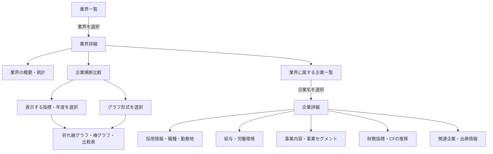
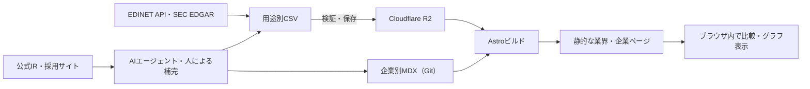

# IT系学生向け企業・業界比較サイト

IT業界をまだ十分に知らない就活生が、業界の特徴を理解し、共通の指標で企業を比較して、応募候補を絞るためのサイトです。

## 想定されるユーザーの需要
IT業界に興味をもつ就活生。

就活においてはまず、業界を大まかに絞りつつ何社か受ける。
その業界選択や会社選択の意思決定の補助を担うのがこのサイトの目的。
### 想定ユーザ挙動
1. IT業界に興味をもつ
2. 検索でこのサイトに辿り着く
3. 業界を知る。平均年収や勤続年数、そしてあらかじめ持っているイメージで選択
4. 企業リストを見る。年収や勤続年数を知る。
5. 詳細を知る。なるほど、こんな事やっているのかって知る。
6. あとは既存の記事に任せる。Open Carrerや運営のサイトへ。

## 画面構成



### 業界一覧

サイトの入口として業界一覧を表示します。ユーザーが業界を選択すると、業界詳細へ移動します。

### 業界詳細・企業比較

業界の概要、業界統計、企業横断比較、所属企業一覧を表示します。ユーザーは対象年度、表示する企業と指標、グラフ形式を選択できます。

業界統計には中央値、平均値、最頻値を表示します。異なる年度の値は混在させず、ユーザーが選択した年度のデータだけを集計します。統計には「集計対象企業数／掲載企業数」を併記し、データがない企業は集計から除外します。

### 企業詳細

企業一覧から企業を選択すると、幸者堂の企業記事を発展させた詳細ページを表示します。採用情報、給与・労働環境、事業内容、事業セグメント、財務指標の推移、関連企業、出典を掲載します。

## 初期必須指標

- 平均年間給与
- 平均年齢
- 平均勤続年数
- 売上高
- 営業利益
- ネットCF（営業CF・投資CF・財務CFの合計としてサイトで算出）
- 営業CF
- 投資CF
- 財務CF
- 自己資本比率
- 事業セグメント

採用職種、勤務地、残業時間、初任給などは、企業詳細の任意項目として扱います。

財務上の健全性について、サイト独自の総合点や「健全」「危険」といった結論は表示しません。自己資本比率、利益、CFなどの指標と推移だけを表示し、応募判断や投資判断を断定しません。

## 比較ルール

- 企業ごとの値に、対象法人、連結・単体、対象年度、単位を持たせる
- 同じ統計には同一年度の値だけを使用する
- 持株会社と事業会社、採用主体と開示主体を区別する
- 日本基準とIFRSなど、会計基準の違いを記録する
- 非公表、取得不能、該当なしを区別する
- 企業再編や会計基準変更により単純比較できない期間には注記する
- 比較結果に優劣を示す評価語を付けない

## データの取得と出典

国内上場企業はEDINET API、米国上場企業はSEC EDGARから法定開示を取得します。法定開示で取得できない採用情報や企業情報は、企業の公式IR、公式採用サイト、公式サイトなどの一次情報を基に、AIエージェントまたは人が補完します。一次情報で取得できない場合のみ、二次情報を参考情報として使用します。

各データには、確認や訂正ができるように出典、対象期間、単位を保持します。初版ではAI入力と手入力を厳密に区別せず、誤りを発見した場合に修正します。

## データ構成

企業横断で比較する構造化データの正本はCSVとし、用途別の複数ファイルに分割します。各ファイルは企業IDや業界IDで関連付けます。
企業詳細ページの構成と自由記述は、1社ごとのMDXで管理します。MDXからCSV表示用のAstroコンポーネントを必要な位置へ挿入できます。編集方法は
[企業ページの編集](docs/content/companies.md)に記載します。

- 企業
- 業界
- 企業と業界の所属関係
- 企業間の関係
- 年度別指標
- 事業セグメント
- 採用情報
- 出典

具体的な保存場所、主キー、欠損値、更新手順は
[データ管理方針](docs/data/README.md)と
[CSVスキーマ定義](docs/data/schema.md)に記載します。

### 企業記事の注記ルール

読者の判断に影響する開示上の制約は、通常の段落ではなくディレクティブに入れます。使い分けは次のとおりです。

| ディレクティブ | 用途 |
| --- | --- |
| `:::error` | 記事冒頭で強調すべき開示上の制約。**非上場企業には必ず冒頭に置く** |
| `:::warn` | 読者の判断に影響する注意。開示主体と採用主体の違い、会計基準・通貨・連結範囲の差、セグメント区分の変更など単純比較できない条件 |
| `:::info` | 本文の意味を補うまとまった但し書き・補足 |

**非上場企業の記事は、冒頭の `CompanyProse` 直後に `:::error` を置きます。** 有価証券報告書の提出義務がないこと、そのために欠ける開示（財務諸表、平均年間給与、平均年齢、平均勤続年数、従業員数、報告セグメント別の数値など）を具体的に書きます。上場企業と同じ指標が並んでいないのは取得漏れではなく開示がないためだ、と読者が最初に判別できるようにするためです。

採用主体が非上場で財務の開示主体が別法人の場合（外資系日本法人、持株会社傘下の事業会社など）も同様に `:::error` とし、どちらの法人の数値を載せているかを併記します。

本文は常体で統一しますが、**ディレクティブの中は敬体でも構いません**。読者への注意喚起なので、地の文と語り口が変わってよい箇所として扱います。`site/src/lib/remark-admonition.mjs` は info / note / tip、warning / warn / caution、danger / error / important を同じ3種類のボックスへ変換しますが、表記を揃えるため記事では `info`、`warn`、`error` の3つだけを使います。

## システム構成

初版では動的なAPIを設けず、Astroのビルド時にR2上のCSVとGit管理の企業別MDXを読み込み、業界ページと企業ページを静的生成します。
指標・年度・グラフの切り替えは、ページ用に生成したデータを使ってブラウザ内で処理します。



## データ更新

CSVの更新から公開までを一連の処理として扱い、MDXだけを編集した場合はAstroの再ビルドから実行します。
初版では手動実行を許容し、運用が安定した段階で定期実行や自動化を検討します。


## 技術構成

- Astro
- Tailwind CSS
- Cloudflare R2
- Cloudflare Workers

## サイトの起動

Astroアプリは `site/` に配置し、ビルド時にルートの `data/*.csv` を直接読み込みます。

```bash
cd site
npm install
npm run dev
```

静的ページを生成する場合は次を実行します。

```bash
cd site
npm run build
```

## EDINETデータ取得

APIキーを `.env` の `EDINET_API` に設定します。`.env` はGitの管理対象外です。

```dotenv
EDINET_API=取得したAPIキー
```

Recruitの2026年3月期有価証券報告書を検索し、最新のCSV ZIPを取得する例です。

```bash
uv run --env-file .env edinet-fetch recruit-holdings \
  --start 2026-06-01 \
  --end 2026-07-31
```

取得した原本は `data/raw/edinet/<docID>/` に展開されます。原本は再取得可能なため、Gitでは管理しません。

取得済みの報告書をもう一度CSVへ変換する場合は、文書IDと決算期末を指定します。

```bash
uv run edinet-normalize recruit-holdings S100YDHL \
  --period-end 2026-03-31
```

変換結果は `data/metrics.csv`、`data/segments.csv`、`data/sources.csv` に企業IDと出典IDで関連付けて保存されます。同じ文書を再実行しても同じキーの行が更新され、重複行は作りません。

## SECデータ取得

SECはAPIキー不要ですが、Fair Access Policyに従い、組織名と監視可能な連絡先を含むUser-Agentを `.env` に設定します。

```dotenv
SEC_USER_AGENT="it-recruit contact@example.org"
```

Amazon.comのForm 10-Kを取得し、Amazon連結財務とAWS報告セグメントを正規化する例です。

```bash
uv run --env-file .env sec-fetch amazon-com \
  --start 2025-06-28 \
  --end 2026-08-02 \
  --form 10-K
```

原本は `data/raw/sec/<CIK>/<accession-number>/` に保存されます。取得済み原本を再変換する場合はアクセッション番号を指定します。

```bash
uv run sec-normalize amazon-com 0001018724-26-000004
```

Amazon連結財務は `amazon-com` の `metrics.csv`、AWSの売上・利益は同じ開示主体の `segments.csv` に保存します。日本の採用主体である `aws-japan` へ親会社の数値を複写しません。SECの通貨・会計基準は原資料どおり保持します。

現行のSEC正規化はForm 10-KのUS GAAPに対応しています。Form 20-Fは提出書類を検索できますが、IFRSなどの正規化ルールが未対応の場合は処理を停止し、CSVへ部分的な値や手入力値を残しません。

## R2への同期

`data/*.csv` をCloudflare R2へアップロードします。中身はAWS CLIの `aws s3 sync` で、認証情報はリポジトリ直下の `.env` から読み込みます。AWS CLI v2が必要です。

```dotenv
R2_ACCESS_KEY_ID=アクセスキーID
R2_SECRET_ACCESS_KEY=シークレットアクセスキー
R2_ENDPOINT=https://<ACCOUNT_ID>.r2.cloudflarestorage.com
R2_BUCKET_NAME=it-recruit
```

まず何が転送されるかを確認します。

```bash
./scripts/sync-r2.sh --dry-run
```

問題なければ同期します。

```bash
./scripts/sync-r2.sh
```

- 転送先は既定で `s3://<バケット>/data/`。`R2_PREFIX` 環境変数で変更できます
- サイズと更新時刻が変わっていないファイルは転送しません（`aws s3 sync` の既定動作）
- `data/raw/` のEDINET原本は再取得できるため既定では対象外です。含める場合は `--include-raw`
- ローカルから削除したCSVをR2からも消す場合は `--delete`。先に `--dry-run --delete` で対象を確認してください
- `--` 以降はそのまま `aws s3 sync` へ渡ります（例: `./scripts/sync-r2.sh -- --exclude "metrics.csv"`）

## ライセンス

このリポジトリは、仕組み（コード・スキル）と掲載物（記事・データ）で別のライセンスを適用します。
著作権者は 幸者堂 (yukijya_doh) です。

| 区分 | 対象 | ライセンス |
| --- | --- | --- |
| コード・スキル | `src/`、`tests/`、`scripts/`、`agents/`、`docs/`、`site/` のソースコードと設定（`site/src/components/`、`site/src/layouts/`、`site/src/lib/`、`site/src/styles/`、`astro.config.mjs`、`wrangler.json`、`pyproject.toml`、`package.json` など）、本 `README.md` | [MIT](LICENSE) |
| サイト掲載コンテンツ | `site/src/pages/` 配下の記事・解説文（`companies/*.mdx`、`industries/`、`guide.md`、`privacy.md`、各ページの散文）、`ledger/`、`data/` のCSV、`site/public/` の画像 | [CC BY-NC-ND 4.0](LICENSE-CONTENT) |

`site/src/pages/` 配下のファイルは、ページを組み立てるコード部分（フロントマター、`import`、コンポーネント呼び出し）はMIT、日本語で書かれた記述・解説文はCC BY-NC-ND 4.0として扱います。

### つまり

- **できること**: 企業分析スキル（`agents/skills/`）やEDINET・SEC取得CLI（`src/`）、サイトのコンポーネントを、自分のプロジェクトへコピー・改変・再配布する。商用利用も可
- **できないこと**: 企業記事や解説文をそのまま転載して別サイトを作る、記事を書き換えて公開する、コンテンツを営利目的で利用する

記事の引用や、非営利での出典明示つきの転載は歓迎します。営利目的での利用や改変版の公開を希望する場合は個別にご相談ください。

### データの出典

`data/` のCSVに含まれる財務・採用の数値は、EDINET（金融庁）、SEC EDGAR、各社公式開示に由来する事実です。事実そのものに本プロジェクトは権利を主張しません。CC BY-NC-ND 4.0が及ぶのは、収集・選択・分類・注記・構成といった編集上の表現部分です。原資料を利用する場合は各提供元の利用条件を確認してください。

企業名、ロゴ、サービス名は各権利者に帰属します。本リポジトリのライセンスは、それらの商標の使用を許諾するものではありません。
